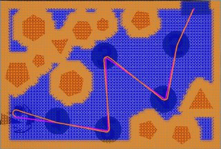

# Laboratory of Applied Robotics Student Interface

Group: IncludeMe
Members: Michele Tessari, David Karbon

# Documentation of student_inteface

## Ovewview

| Main Functions                                                                                                                                                                                                                                                                  | Descriptions                                                                                                        |
| ------------------------------------------------------------------------------------------------------------------------------------------------------------------------------------------------------------------------------------------------------------------------------- | ------------------------------------------------------------------------------------------------------------------- |
| `void`[`loadImage`]`(cv::Mat & img_out,const std::string & config_folder)`                                                                                                                                                                                                      | This function can be used to replace the simulator camera and test the developed pipeline on a set of custom image. |
| `void`[`genericImageListener`]`(const cv::Mat & img_in,std::string topic,const std::string & config_folder)`                                                                                                                                                                    | Generic listener used from the image listener node.                                                                 |
| `bool`[`extrinsicCalib`]`(const cv::Mat & img_in,std::vector< cv::Point3f > object_points,const cv::Mat & camera_matrix,cv::Mat & rvec,cv::Mat & tvec,const std::string & config_folder)`                                                                                       | Finds arena pose from 3D(object_points)-2D(image_in) point correspondences.                                         |
| `void`[`imageUndistort`]`(const cv::Mat & img_in,cv::Mat & img_out,const cv::Mat & cam_matrix,const cv::Mat & dist_coeffs,const std::string & config_folder)`                                                                                                                   | Transforms an image to compensate for lens distortion.                                                              |
| `void`[`findPlaneTransform`]`(const cv::Mat & cam_matrix,const cv::Mat & rvec,const cv::Mat & tvec,const std::vector< cv::Point3f > & object_points_plane,const std::vector< cv::Point2f > & dest_image_points_plane,cv::Mat & plane_transf,const std::string & config_folder)` | Calculates a perspective transform from four pairs of the corresponding points.                                     |
| `void`[`unwarp`]`(const cv::Mat & img_in,cv::Mat & img_out,const cv::Mat & transf,const std::string & config_folder)`                                                                                                                                                           | Applies a perspective transformation to an image.                                                                   |
| `bool`[`processMap`]`(const cv::Mat & img_in,const double scale,std::vector< Polygon > & obstacle_list,std::vector< std::pair< int, Polygon >> & victim_list,Polygon & gate,const std::string & config_folder)`                                                                 | Process the image to detect victims, obtacles and the gate                                                          |
| `bool`[`findRobot`]`(const cv::Mat & img_in,const double scale,Polygon & triangle,double & x,double & y,double & theta,const std::string & config_folder)`                                                                                                                      | Process the image to detect the robot pose                                                                          |
| `bool planPath(const Polygon& borders, const std::vector<Polygon>& obstacle_list, const std::vector<std::pair<int,Polygon>>& victim_list, const Polygon& gate, const float x, const float y, const float theta, Path& path, const std::string& config_folder)`                  | Plan the path according to chosen mission.                                                                          |

## Computer Vision

### genericImageListener

```c++
void genericImageListener(const cv::Mat &img_in, std::string topic, const std::string &config_folder)
```

function to save the images from the camera to be used in a second moment to calculate the distortion parameters of the camera or for other purpose.

The function creates the folder (from the configuration default path) where to save the images and, if it already exists, it continues to try with another name until it will find one. Then it shows the image of the current visual of the camera and (if 's' is pressed) it saves the image in the folder. Otherwise, if 'esc' is pressed, the program will close.

### extrinsicCalib

```c++
bool extrinsicCalib(const cv::Mat &img_in, std::vector<cv::Point3f> object_points,
                    const cv::Mat &camera_matrix, cv::Mat &rvec, cv::Mat &tvec, const std::string &config_folder)
```

estimate the rotation and translation vectors of the camera starting from the undistorted image of the camera and the points of the arena.

First the function check if it already exists the file with the measurement of the points of the arena precedently setted. If the file doesn't exists, it will appear a image of the camera where will be asked to the user to click in the four corner of the arena in counterclockwise order. After, using the function "solvePnP" are computed the rotation and translation vectors of the camera.

### imageUndistort

```c++
void imageUndistort(const cv::Mat &img_in, cv::Mat &img_out, const cv::Mat &cam_matrix,
                    const cv::Mat &dist_coeffs, const std::string &config_folder)
```

It removes the distortion of the lens of the camera from the image in input from the parameters computed during the camera calibration phase.

Since it's sufficient to calculate the calibration matrix to transform the image only one time, The function, when it's called the first time, it uses initUndistortRectifyMap() to compute the two maps of the two axis X and Y of the calibration matrix.
Finally, everyyime the function is called, it computes the undistorted image with the function "remap()" using the 2 maps precedently calculated.

### findPlaneTransform

```c++
void findPlaneTransform(const cv::Mat &cam_matrix, const cv::Mat &rvec, const cv::Mat &tvec,
                        const std::vector<cv::Point3f> &object_points_plane,
                        const std::vector<cv::Point2f> &dest_image_points_plane, cv::Mat &plane_transf,
                        const std::string &config_folder)
```

It computes the transformation matrix to unwrap the image from the points taken before.

using "projectPoints()" function, findPlaneTransform() projects the 3D points to a 2D image plane and then with "getPerspectiveTransform()" it computes the 3x3 perspective transformation of the corrisponding points.

### unwarp

```c++
void unwarp(const cv::Mat &img_in, cv::Mat &img_out, const cv::Mat &transf, const std::string &config_folder)
```

it applys the transformation to convert the 3D points in a 2D plane.

using "warpPerspective()" function it applies the transformation computed by "findPlaneTransform()" to unwrap the image and get a top-view visualization

### processMap

```c++
bool processMap(const cv::Mat &img_in, const double scale, std::vector<Polygon> &obstacle_list,
                std::vector<std::pair<int, Polygon>> &victim_list, Polygon &gate, const std::string &config_folder)
```

Process the image to detect victims, obstacles and the gate.

code flow: obstacle list

0. convert input image in hsv colorspace
1. use a colorfilter to sort the objects in different masks (red for obstacles and green for victims and the gate)
1. apply in the red mask the dilate and erode morphological transformations
1. extract contour of the obstacles with findContours(), approximate them with approxPolyDP() and finally scale them
1. Assign the found obstacles in the output list
1. apply in the green mask the dilate and erode morphological transformations
1. extract contour of the victims and the gate with findContours(), approximate them with approxPolyDP(), scale them and finally extract the gate by controlling its contour size(=4)
1. victims elaboration process:
   - detect round contours (with size > 4)
   - eliminate the green surrounding using as a mask the not operation of the green mask
   - load the template numbers and flip them to match the camera perspective transformation applied in unwarp()
   - run the number detection for every boundingBox:
     - extract the region of interest from the image with the boundingBox
     - resize it to template size
     - compare the detected numbers with the templates trying 4 different rotation (90 degrees) and compute the mathing score
     - select the tamplate according too the heighest matching score
     - save the pair of matched template number and scaled victim in a map in order to sort them
     - copy the ordered map into the output vector

### findRobot

```c++
bool findRobot(const cv::Mat &img_in, const double scale, Polygon &triangle, double &x, double &y, double &theta, const std::string &config_folder)
```

find the position and rotation of the robot

0. convert input image in hsv colorspace
1. filter the blue areas out of the hsv image
1. find the contour of the robot triangle using findContours()
1. approximate the contours
1. look for the triangle contour by taking off all the areas which are too small ot too big and the contours with too edges
1. scale the found triangle contour
1. compute the position and rotation vectors of the robot (center of gravity and rotation relative to the x axis)

---

### plan Path

```c++
bool planPath(const Polygon& borders, const std::vector<Polygon>& obstacle_list,  const std::vector<std::pair<int,Polygon>>& victim_list,  const Polygon& gate, const float x, const float y, const float theta,  Path& path, const std::string& config_folder);
```

##### Parameters

- `borders [in]` border of the arena [m]
- `obstacle_list [in]` list of obstacle polygon [m]
- `victim_list [in]` list of pair victim_id and polygon [m]
- `gate [in]` polygon representing the gate [m]
- `x [in]` x position of the robot in the arena reference system
- `y [in]` y position of the robot in the arena reference system
- `theta [in]` yaw of the robot in the arena reference system
- `path [out]` output path of planned path
- `config_folder [in]` A custom string from config file.

##### Description

To selsect the desired Mission change the bool in line 28 in student_interface.cpp

- bool MISSION_PLANNING = false; for Mission 1
- bool MISSION_PLANNING = true; for Mission 2

**MISSION 1:**
Victim are chosen in in oreder if their number. The robot drives over all victims in order from lowest number to the heighest


**MISSION 2:**

1. a table with the corresponding distances is created (calculated with smoothed path) [simetric]
   

2. From this table a tree is created which holds each possible combination. The cost and the reward is summed to obtain the best desiction. When we arrive at a gate node, the result is saved.
   

3. the resulting output vector contains the path with the heighest score = lowest time
   

##### Returns

- `bool` true if path is computed correctly, false otherwise

for more detail see paragraph missionPlannnig.ccp

## Path Planning

### gridBasedPlanning.cpp

```c++
void buildGridGraph(Graph::Graph &graph, const std::vector<Polygon> &obstacle_list,const Polygon& gate,
 float margin, int nVert, int nOriz, float sideLength);
```

##### Parameters

- `Graph::Graph &graph` The graph structure defined in graph.h including the nodes
- `const std::vector<Polygon> &obstacle_list` the obstacle list
- `const Polygon& gate` The gate
- `float margin` the safety distance from the border
- `float sideLength` length of the map
- `int nVert` number of squares in vertical direction
- `int nOriz` number of squares in Orizontal direction

##### Description

1. calculates the neccessary number of nodes
2. checks if the node is inside an obstacle ( dilated bz the robo radius)
3. connects the node to its neigbours in linear and diagonal direction as long they are not inside an

---

### Astar_pathplanning.cpp

```c++
vector<int> Astar::Solve_AStar(Graph::Graph &graph, int nodeStart, int nodeEnd)
```

##### Parameters

- `Graph::Graph &graph` The graph structure defined in graph.h and already connected with buildGridGraph()
- `int nodeStart` the number of the start node in the graph
- `int nodeEnd` the number of the end node in the graph

##### Description

1. resets the navigation graph. Every node:
   visited = false;
   fGlobalGoal = INFINITY;
   fLocalGoal = INFINITY;
   parent = -1; // No parents
2. set up of the starting condition for the node start
3. Loop for all the nodes in the graph until we reach the goal
   1. calculate the distance to goal for each neighbour
   2. calculate the ditance to start for each neigbour and set the current node as parent for the neighbour if it is the shortest
   3. take neighbour node with the shortest global distance to goal in with which we continue this loop
   4. set the tag visited to the visited node, to not test it again
4. Once reached the goal we create a vector where we:
   1. enter the goal node
   2. go to its parent node
   3. enter it and go again to its parent nonde
   4. repeat until we reach the start
5. Reverse the previous vector to have the nodes in correct order.

##### Return

- vector<int> Vector of the nodes where the path passes trough

---

```c++
void Astar::smoothPath(Graph::Graph &graph, vector<int> &path,
 vector<int> &newPath, const std::vector<Polygon> &obstacle_list)
```

##### Parameters

- `Graph::Graph &graph` the graph structure defined in graph.h and already connected with buildGridGraph()
- `vector<int> &path` the path crated by A\* star
- `vector<int> &newPath` the smoothed path
- `const std::vector<Polygon> &obstacle_list` the dilated obstacle list

##### Description

1. Takes the start point and the end point of the A\* path
2. connects them with a streight line
3. checks for collision with an obstacle
4. if an collision is detected take the mid point of the path and repeat the procedure until the smoothed path is collision free

---

```c++
float Astar::distance(Graph::Graph &graph, int a, int b)
```

##### Parameters

- `Graph::Graph &graph` the graph structure defined in graph.h and already connected with buildGridGraph()
- `int a` reference int for start
- `int b` reference int for end

##### Description

1. calculates the heuristic distance from one point to another

##### Return

- `float` the distance between two points

---

### Pictures of path planning

<p float="float">
      
      
      
      
      
      
<p!>

1. raw Astar path with grid real arena
2. smoothed path real arena
3. dubins curve of Mission 1 real arena
4. dubins curve of Mission 2 real arena
5. dubins curve of Mission 1 simulator
6. dubins curve of Mission 2 simulator

---

### collision_detection.cpp

```c++
bool intersect(const Point &a0, const Point &a1, const Point &b0, const Point &b1)
```

##### Parameters

- `const Point &a0` start point of segment 1
- `const Point &a1` end point of segment 1
- `const Point &b0` start point of segment 2
- `const Point &b1` end point of segment 2

##### Description

1. calcluates the vectors of the segments
   1. a0->a1
   2. b0->b1
   3. b0->a0
2. Calculates the determinandt of the vectors a0->a1 and b0->b1
3. calculates the parameters r and s which have to be inside the range of [0,1] if the segments intersect

#### Return

`bool` if a collision was detected -> true

---

```c++
bool intersectPolygon(const Point &a0, const Point &a1, const Polygon &p)
```

##### Parameters

- `const Point &a0` start point of segment 1
- `const Point &a1` end point of segment 1
- `const Polygon &p` Polygon for intersection test

##### Description

1. checks the intersection of a segment with all the segments of a Polygon

#### Return

`bool` if a collision was detected -> true

---

```c++
bool intersect_Global(const Point &a0, const Point &a1, const std::vector<Polygon> &obstacle_list)
```

##### Parameters

- `const Point &a0` start point of segment 1
- `const Point &a1` end point of segment 1
- `const std::vector<Polygon> &obstacle_list` the dilated obstacle list

##### Description

1. checks the intersection of a segment with all the obstacles in the arena

#### Return

`bool` if a collision was detected -> true

---

### DubinsCurves.cpp

```c++
DubinsCurve DubinsCurvesHandler::findShortestPath(double x0, double y0, double th0,
double xf, double yf, double thf)
```

##### Parameters

- `double x0` x coordinate of initial position
- `double y0` y coordinate of initial position
- `double th0` orientation of the robot in the initial position
- `double x1` x coordinate of initial position
- `double y1` y coordinate of initial position
- `double th1` orientation of the robot in the final position

##### Description

- Solve the Dubins problem for the given input parameters.
- The function tries all the possible primitives to find the optimal solution

---

#### Return

- Return the type and the parameters of the optimal curve

````c++
 ScaledParams scaleToStandard(double x0, double y0, double th0, double xf, double yf, double thf);```
````

##### Parameters

- `double x0` x coordinate of initial position
- `double y0` y coordinate of initial position
- `double th0` orientation of the robot in the initial position
- `double x1` x coordinate of initial position
- `double y1` y coordinate of initial position
- `double th1` orientation of the robot in the final position

##### Description

- Scale the input problem to standard form
- finds the transform parameters
- calculate phi, the normalised angel
- scale and normalize angles and curvature

##### Return

- `ScaledParams`

````c++
 ScaledParams scaleFromStandard(double x0, double y0, double th0, double xf, double yf, double thf);```
````

##### Parameters

- `double x0` x coordinate of initial position
- `double y0` y coordinate of initial position
- `double th0` orientation of the robot in the initial position
- `double x1` x coordinate of initial position
- `double y1` y coordinate of initial position
- `double th1` orientation of the robot in the final position

##### Description

- Scale the solution to the standard problem back to the original problem

##### Return

---

```c++
 ScaledCurveSegments LSL(double sc_th0, double sc_thf, double sc_k_max, double sc_k_max_inv);
```

Same for RSR, LSR,RSL, RLR,LRL

##### Parameters

- `double sc_th0`
- `double sc_thf`
- `double sc_k_max`
- `double sc_k_max_inv`

##### Description

- calculate the path

##### Return

`ScaledCurveSegments`

```c++
DubinsLine computeDubinsLine(double L, double x0, double y0, double th0, double k);
```

##### Parameters

- `double L`
- `double x0`
- `double y0`
- `double th0`
- `double k`

##### Description

1.

##### Return

`DubinsLine`

```c++
DubinsArc computeDubinsArc(double x0, double y0, double th0, double k, double L);
```

##### Parameters

- `double L`
- `double x0`
- `double y0`
- `double th0`
- `double k`

##### Description

- Create a structure representing an arc of a Dubins curve (straight or circular)

##### Return

`DubinsLine`

```c++
DubinsCurve computeDubinsCurve(double x0, double y0, double th0, double s1, double s2,
double s3, double k1, double k2, double k3);
```

##### Parameters

- `double x0`
- `double y0`
- `double th0`
- `double s1`
- `double s2`
- `double s3`
- `double k1`
- `double k2`
- `double k3`

##### Description

- Create a structure representing a Dubins curve (composed by three arcs)

##### Return

`DubinsCurve`

    ```c++
    bool check(double s1, double s2, double s3, double k0,
    double k1, double k2, double th0, double thf);
    ```

##### Parameters

- `double s1`
- `double s2`
- `double s3`
- `double k0`
- `double k1`
- `double k2`
- `double th0`
- `double thf`

##### Description

- Check validity of a solution by evaluating explicitly the 3 equations
  defining a Dubins problem (in standard form)

##### Return

`bool`

### MissionPLanning.cpp

    ```c++
       explicit MissionPlanning(float bonusTime, const float x, const float y, vector<Polygon> &obstacle_list,
       const vector<pair<int, Polygon>> &victim_list, const Polygon &gate);
    ```

##### Parameters

- `float bonusTime` bonus time in second for passing over a victim
- `float x` Robot x coordinate
- `float y` Robot x coordinate
- `std::vector<Polygon> &obstacle_list` the dilated obstacle vector
- `const vector<pair<int, Polygon>> &victim_list` victim vector
- `Polygon &gate` gate

-

##### Description

- constructer of the class MissionPlanning

  ```c++
  vector<Pose> buildDecisionPath(Graph::Graph &graph, int nVert, int nOriz, float sideLength);
  ```

##### Parameters

- `Graph::Graph &graph` The graph structure defined in graph.h including the nodes
- `float sideLength` length of the map
- `int nVert` number of squares in vertical direction
- `int nOriz` number of squares in Orizontal direction

##### Description

- creates the table including the distance between the possible targets using astar and path smoothing
- calls the function pickDesition in a recursive way in order to create a desition tree.

```c++
  pair<float, vector<int>> MissionPlanning::pickDecision(float \*\*costs, vector<decision> &decisions, set<int> remaining, float currCost, int curr)
```

##### Parameters

- `float **costs` The graph structure defined in graph.h including the nodes
- `vector<decision> &decisions` length of the map
- `set<int> remaining` number of squares in vertical direction
- `float currCost` number of squares in Orizontal direction
- `int curr` number of squares in Orizontal direction

##### Description

- creates a desition tree with all possible combination of paths

##### Return

- array of int containng the nodes for the path with the heighest score

```c++
void initDecisions(vector<decision> &decisions);
```

##### Parameters

- `vector<decision> &decisions`

##### Description

-??????????

```c++
float MissionPlanning::pathLength(Graph::Graph &graph, vector<int> path)
```

##### Parameters

- `Graph::Graph &graph` The graph structure defined in graph.h including the nodes
- `vector<int> path` the path to check

##### Description

- calculates the length of a smoothed path with A\* algorithm

##### Return

`float` length of the path

```c++
Point MissionPlanning::avgPoint(const Polygon &polygon)
```

##### Parameters

- `const Polygon &polygon` Polygon

##### Description

- calculates the center point of a polygon

##### Return

`Point` center point of a polygon
