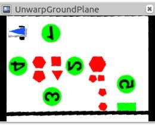

# Laboratory of Applied Robotics Student Interface

Group: IncludeMe
Members: Michele Tessari, David Karbon

# Documentation of student_inteface

## Overview

| Main Functions                                                                                                                                                                                                                                                                  | Descriptions                                                                                                        |
| ------------------------------------------------------------------------------------------------------------------------------------------------------------------------------------------------------------------------------------------------------------------------------- | ------------------------------------------------------------------------------------------------------------------- |
| `void`[`loadImage`]`(cv::Mat & img_out,const std::string & config_folder)`                                                                                                                                                                                                      | This function can be used to replace the simulator camera and test the developed pipeline on a set of custom image. |
| `void`[`genericImageListener`]`(const cv::Mat & img_in,std::string topic,const std::string & config_folder)`                                                                                                                                                                    | Generic listener used from the image listener node.                                                                 |
| `bool`[`extrinsicCalib`]`(const cv::Mat & img_in,std::vector< cv::Point3f > object_points,const cv::Mat & camera_matrix,cv::Mat & rvec,cv::Mat & tvec,const std::string & config_folder)`                                                                                       | Finds arena pose from 3D(object_points)-2D(image_in) point correspondences.                                         |
| `void`[`imageUndistort`]`(const cv::Mat & img_in,cv::Mat & img_out,const cv::Mat & cam_matrix,const cv::Mat & dist_coeffs,const std::string & config_folder)`                                                                                                                   | Transforms an image to compensate for lens distortion.                                                              |
| `void`[`findPlaneTransform`]`(const cv::Mat & cam_matrix,const cv::Mat & rvec,const cv::Mat & tvec,const std::vector< cv::Point3f > & object_points_plane,const std::vector< cv::Point2f > & dest_image_points_plane,cv::Mat & plane_transf,const std::string & config_folder)` | Calculates a perspective transform from four pairs of the corresponding points.                                     |
| `void`[`unwarp`]`(const cv::Mat & img_in,cv::Mat & img_out,const cv::Mat & transf,const std::string & config_folder)`                                                                                                                                                           | Applies a perspective transformation to an image.                                                                   |
| `bool`[`processMap`]`(const cv::Mat & img_in,const double scale,std::vector< Polygon > & obstacle_list,std::vector< std::pair< int, Polygon >> & victim_list,Polygon & gate,const std::string & config_folder)`                                                                 | Process the image to detect victims, obtacles and the gate                                                          |
| `bool`[`findRobot`]`(const cv::Mat & img_in,const double scale,Polygon & triangle,double & x,double & y,double & theta,const std::string & config_folder)`                                                                                                                      | Process the image to detect the robot pose                                                                          |
| `bool planPath(const Polygon& borders, const std::vector<Polygon>& obstacle_list, const std::vector<std::pair<int,Polygon>>& victim_list, const Polygon& gate, const float x, const float y, const float theta, Path& path, const std::string& config_folder)`                  | Plan the path according to chosen mission.                                                                          |

## Computer Vision

### genericImageListener

```c++
void genericImageListener(const cv::Mat &img_in, std::string topic, const std::string &config_folder)
```

##### Parameters

- `image_in [in]` Input image to store

- `topic [in]` Topic from where the image is taken

- `config_folder [in]` A custom string from config file.

##### Description

function to save the images from the camera to be used in a second moment to calculate the distortion parameters of the camera or for other purpose.

The function creates the folder (from the configuration default path) where to save the images and, if it already exists, it continues to try with another name until it will find one. Then it shows the image of the current visual of the camera and (if 's' is pressed) it saves the image in the folder. Otherwise, if 'esc' is pressed, the program will close.

### extrinsicCalib

```c++
bool extrinsicCalib(const cv::Mat &img_in, std::vector<cv::Point3f> object_points,
                    const cv::Mat &camera_matrix, cv::Mat &rvec, cv::Mat &tvec, const std::string &config_folder)
```

##### Parameters

- `image_in [in]` Input image to store

- `object_points [in]` 3D position of the 4 corners of the arena, following a counterclockwise order starting from the one near the red line.

- `camera_matrix [in]` 3x3 floating-point camera matrix

- `rvec [out]` Rotation vectors estimated linking the camera and the arena

- `tvec [out]` Translation vectors estimated for the arena

- `config_folder [in]` A custom string from config file.

##### Description

First the function check if it already exists the file with the measurement of the points of the arena precedently setted. If the file doesn't exists, it will appear a image of the camera where will be asked to the user to click in the four corner of the arena in counterclockwise order. After, using the function "solvePnP" are computed the rotation and translation vectors of the camera.

##### Returns

`[bool]` false if there are some errors, true otherwise

---

### imageUndistort

```c++
void imageUndistort(const cv::Mat &img_in, cv::Mat &img_out, const cv::Mat &cam_matrix,
                    const cv::Mat &dist_coeffs, const std::string &config_folder)
```

##### Parameters

- `image_in [in]` distorted image

- `image_out [out]` undistorted image

- `camera_matrix [in]` 3x3 floating-point camera matrix

- `dist_coeffs [out]` distortion coefficients [k1,k2,p1,p2,k3]

- `config_folder [in]` A custom string from config file.

##### Description

It removes the distortion of the lens of the camera from the image in input from the parameters computed during the camera calibration phase.

Since it's sufficient to calculate the calibration matrix to transform the image only one time, The function, when it's called the first time, it uses initUndistortRectifyMap() to compute the two maps of the two axis X and Y of the calibration matrix.
Finally, everyyime the function is called, it computes the undistorted image with the function "remap()" using the 2 maps precedently calculated.

##### Results

1. Distorted image

- 

2. Undistorted image

- 

---

### findPlaneTransform

```c++
void findPlaneTransform(const cv::Mat &cam_matrix, const cv::Mat &rvec, const cv::Mat &tvec,
                        const std::vector<cv::Point3f> &object_points_plane,
                        const std::vector<cv::Point2f> &dest_image_points_plane, cv::Mat &plane_transf,
                        const std::string &config_folder)
```

##### Parameters

- `camera_matrix [in]` 3x3 floating-point camera matrix

- `rvec [in]` Rotation vectors estimated linking the camera and the arena

- `tvec [in]` Translation vectors estimated for the arena

- `object_points_plane [in]` 3D position of the 4 corners of the arena, following a counterclockwise order starting from the one near the red line.

- `dest_image_points_plane [in]` destinatino point in px of the object_points_plane

- `plane_transf [out]` plane perspective trasform (3x3 matrix)

- `config_folder [in]` A custom string from config file.

##### Description

It computes the transformation matrix to unwrap the image from the points taken before.

using "projectPoints()" function, findPlaneTransform() projects the 3D points to a 2D image plane and then with "getPerspectiveTransform()" it computes the 3x3 perspective transformation of the corrisponding points.

---

### unwarp

```c++
void unwarp(const cv::Mat &img_in, cv::Mat &img_out, const cv::Mat &transf, const std::string &config_folder)
```

##### Parameters

- `image_in [in]` input image

- `image_out [out]` unwarped image

- `transf [in]` plane perspective trasform (3x3 matrix)

- `config_folder [in]` A custom string from config file.

##### Description

it applys the transformation to convert the 3D points in a 2D plane.

using "warpPerspective()" function it applies the transformation computed by "findPlaneTransform()" to unwrap the image and get a top-view visualization

1. unwraped image

- 

---

### processMap

```c++
bool processMap(const cv::Mat &img_in, const double scale, std::vector<Polygon> &obstacle_list,
                std::vector<std::pair<int, Polygon>> &victim_list, Polygon &gate, const std::string &config_folder)
```

##### Parameters

- `image_in [in]` input image

- `scale [in]` scale parameter to bring a pixel in meters

- `obstacle_list [out]` list of obstacle polygon (vertex in meters)

- `victim_list [out]` list of pair victim_id and polygon (vertex in meters)

- `gate [out]` polygon representing the gate (vertex in meters)

- `config_folder [in]` A custom string from config file.

##### Description

Process the image to detect victims, obstacles and the gate.

code flow: obstacle list

0. convert input image in hsv colorspace
1. use a colorfilter to sort the objects in different masks (red for obstacles and green for victims and the gate)
1. apply in the red mask the dilate and erode morphological transformations
1. extract contour of the obstacles with findContours(), approximate them with approxPolyDP() and finally scale them
   1.controll the area of the obstacles. If it is too small, delet it
1. Assign the found obstacles in the output list

- Red mask matrix, on which the shape detection is done
- 

2. apply in the green mask the dilate and erode morphological transformations
3. extract contour of the victims and the gate with findContours(), approximate them with approxPolyDP(), scale them and finally extract the gate by controlling its contour size. The smallest contour is the gate
4. victims elaboration process:
   - consider the obstacles with a min area of 500 and contour size greater than the smallest one
   - eliminate the green surrounding using as a mask the not operation of the green mask
   - load the template numbers and flip them to match the camera perspective transformation applied in unwarp()
   - run the number detection for every boundingBox:
     - extract the region of interest from the image with the boundingBox
     - resize it to template size
     - compare the detected numbers with the templates trying 4 different rotation (90 degrees) and compute the mathing score
     - select the tamplate according too the heighest matching score
     - save the pair of matched template number and scaled victim in a map in order to sort them
     - copy the ordered map into the output vector

- Green mask matrix
- 
- Shape detection for Green and Red bodies
- 
- Template matching example
- 

##### Return

- `bool` True if one gate is found, otherwise return false

---

### findRobot

```c++
bool findRobot(const cv::Mat &img_in, const double scale, Polygon &triangle, double &x, double &y, double &theta, const std::string &config_folder)
```

##### Parameters

- `image_in [in]` input image

- `scale [in]` 1px/scale = X meters

- `x [out]` x position of the robot in the arena reference system

- `y [out]` y position of the robot in the arena reference system

- `theta [out]` yaw of the robot in the arena reference system

- `config_folder [in]` A custom string from config file.

##### Description

find the position and rotation of the robot

1. convert input image in hsv colorspace
2. filter the blue areas out of the hsv image
3. find the contour of the robot triangle using findContours()
4. approximate the contours
5. look for the triangle contour by taking off all the areas which are too small ot too big and the contours with too edges
6. scale the found triangle contour
7. compute the position and rotation vectors of the robot (center of gravity and rotation relative to the x axis)

- blue mask
- 

---

### plan Path

```c++
bool planPath(const Polygon& borders, const std::vector<Polygon>& obstacle_list,  const std::vector<std::pair<int,Polygon>>& victim_list,  const Polygon& gate, const float x, const float y, const float theta,  Path& path, const std::string& config_folder);
```

##### Parameters

- `borders [in]` border of the arena [m]
- `obstacle_list [in]` list of obstacle polygon [m]
- `victim_list [in]` list of pair victim_id and polygon [m]
- `gate [in]` polygon representing the gate [m]
- `x [in]` x position of the robot in the arena reference system
- `y [in]` y position of the robot in the arena reference system
- `theta [in]` yaw of the robot in the arena reference system
- `path [out]` output path of planned path
- `config_folder [in]` A custom string from config file.

##### Description

To select the desired Mission change the bool in line 28 in student_interface.cpp

- bool MISSION_PLANNING = false; for Mission 1
- bool MISSION_PLANNING = true; for Mission 2

**MISSION 1:**
Victim are chosen in order of their number. The robot drives over all victims and follows the path from the lowest number to the highest

- Mission planning 1 output
- 

**MISSION 2:**

1. a table with the corresponding distances from each waypoint to every other is created (calculated with smoothed path)

- 

2. From this table a tree is created which holds each possible combination. The cost and the reward is summed to obtain the best decision. When we arrive at a gate node, the result is saved.

- 

3. the resulting output vector contains the path with the highest score = lowest time

- 

##### Returns

- `bool` true if path is computed correctly, false otherwise

for more detail see paragraph missionPlannnig.ccp

## Path Planning

### graph.hpp

```c++
namespace Graph
{

    struct node
    {
        bool visited = false; // Have we searched this node before?
        bool obstacle = false;
        bool removed = false;
        float fGlobalGoal;    // Distance to goal so far
        float fLocalGoal;     // Distance to goal if we took the alternative route
        float x;              // Nodes position in 2D space
        float y;
        std::vector<int> neighbours; // Connections to neighbours
        int parent; // Node connecting to this node that offers shortest parent
    };

    typedef std::vector<node> Graph;
};

```

#### Description

- provides the structure for the graph

---

### gridBasedPlanning.cpp

```c++
void buildGridGraph(Graph::Graph &graph, const std::vector<Polygon> &obstacle_list,const Polygon& gate,
 float margin, int nVert, int nOriz, float sideLength);
```

##### Parameters

- `Graph::Graph &graph` The graph structure defined in graph.h including the nodes
- `const std::vector<Polygon> &obstacle_list` the obstacle list
- `const Polygon& gate` The gate
- `float margin` the safety distance from the border
- `float sideLength` length of the map
- `int nVert` number of squares in vertical direction
- `int nOriz` number of squares in horizontal direction

##### Description

1. calculates the necessary number of nodes
2. checks if the node is inside an obstacle ( dilated by the robots radius)
3. connects the node to its neighbours in linear and diagonal direction as long they are not inside an

---

### Astar_pathplanning.cpp

```c++
class Astar
{
private:
	int nodeStart = 0;
	int nodeEnd = 0;

	static float distance(Graph::Graph &graph, int a, int b);
	static float heuristic(Graph::Graph &graph, int a, int b);

public:
	static vector<int> Solve_AStar(Graph::Graph &graph, int start, int end);
	static void smoothPath(Graph::Graph& graph, vector<int> &path, vector<int> &newPath, const std::vector<Polygon> &obstacle_list);
};

```

```c++
vector<int> Astar::Solve_AStar(Graph::Graph &graph, int nodeStart, int nodeEnd)
```

##### Parameters

- `Graph::Graph &graph` The graph structure defined in graph.h and already connected with buildGridGraph()
- `int nodeStart` the number of the start node in the graph
- `int nodeEnd` the number of the end node in the graph

##### Description

1. resets the navigation graph. Every node:
   visited = false;
   fGlobalGoal = INFINITY;
   fLocalGoal = INFINITY;
   parent = -1; // No parents
2. set up of the starting condition for the node start
3. Loop for all the nodes in the graph until we reach the goal
   1. calculate the distance to goal for each neighbour
   2. calculate the distance to start for each neighbour and set the current node as parent for the neighbour if it is the shortest
   3. take neighbour node with the shortest global distance to goal in with which we continue this loop
   4. set the tag visited to the visited node, to not test it again
4. Once reached the goal we create a vector where we:
   1. enter the goal node
   2. go to its parent node
   3. enter it and go again to its parent node
   4. repeat until we reach the start
5. Reverse the previous vector to have the nodes in correct order.

##### Return

- vector<int> Vector of the nodes where the path passes trough

---

```c++
void Astar::smoothPath(Graph::Graph &graph, vector<int> &path,
 vector<int> &newPath, const std::vector<Polygon> &obstacle_list)
```

##### Parameters

- `Graph::Graph &graph` the graph structure defined in graph.h and already connected with buildGridGraph()
- `vector<int> &path` the path crated by A\* star
- `vector<int> &newPath` the smoothed path
- `const std::vector<Polygon> &obstacle_list` the dilated obstacle list

##### Description

1. Takes the start point and the end point of the A\* path
2. connects them with a straight line
3. checks for collision with an obstacle
4. if an collision is detected take the mid point of the path and repeat the procedure until the smoothed path is collision free

---

```c++
float Astar::distance(Graph::Graph &graph, int a, int b)
```

##### Parameters

- `Graph::Graph &graph` the graph structure defined in graph.h and already connected with buildGridGraph()
- `int a` reference int for start
- `int b` reference int for end

##### Description

1. calculates the heuristic distance from one point to another

##### Return

- `float` the distance between two points

---

### Pictures of path planning

<p float="float">
      
      
      
      
      
<p!>

1. raw Astar path with grid real arena
2. smoothed path real arena
3. dubins curve of Mission 1 real arena
4. dubins curve of Mission 1 simulator
5. dubins curve of Mission 2 simulator

---

### collision_detection.cpp

```c++
bool collide(Polygon a, Polygon b);
bool isInside_Global(const Point& p, const std::vector<Polygon> &obstacle_list);
bool isInside(const Point& point, const Polygon& polygon);
bool intersect(const Point& a0, const Point& a1, const Point& b0, const Point& b1);
bool intersectPolygon(const Point& a0, const Point& a1, const Polygon& p);
bool intersect_Global(const Point& a0, const Point& a1, const std::vector<Polygon> &obstacle_list);
bool intersectCircle_Global(float a, float b, float r, const std::vector<Polygon> &obstacle_list);
bool intersectCircleLine(float a, float b,float r, float x1, float x2, float y1, float y2);
std::vector<Polygon> offsetPolygon(const std::vector<Polygon> &polygons, float offset);

```

#### Functions used in our program

```c++
bool isInside(const Point& point, const Polygon& polygon);
```

##### Parameters

- `const Point &point` Point on which I want to check
- `const Polygon &polygon` Polygon

##### Description

1. reveals if a point is inside a polygon
   1. from the point it draws a infinite line to the right
   2. it counts how many times the line intersects a segment of a polygon
      1. if it is even the point is outside
      2. if it is odd the point is inside

#### Return

`bool` if a collision was detected -> true

---

```c++
bool isInside_Global(const Point& p, const std::vector<Polygon> &obstacle_list);
```

##### Parameters

- `const Point &point` Point on which I want to check
- `const std::vector<Polygon> &obstacle_list` The obstacle list of the map

##### Description

1. reveals if a point is any Polygon of the map

#### Return

`bool` if a collision was detected -> true

---

```c++
bool intersect(const Point &a0, const Point &a1, const Point &b0, const Point &b1)
```

##### Parameters

- `const Point &a0` start point of segment 1
- `const Point &a1` end point of segment 1
- `const Point &b0` start point of segment 2
- `const Point &b1` end point of segment 2

##### Description

- reveals if a segment intersects with a polygon

1. calcluates the vectors of the segments
   1. a0->a1
   2. b0->b1
   3. b0->a0
2. Calculates the determinant of the vectors a0->a1 and b0->b1
3. calculates the parameters r and s which have to be inside the range of [0,1] if the segments intersect

#### Return

`bool` if a collision was detected -> true

---

```c++
bool intersectPolygon(const Point &a0, const Point &a1, const Polygon &p)
```

##### Parameters

- `const Point &a0` start point of segment 1
- `const Point &a1` end point of segment 1
- `const Polygon &p` Polygon for intersection test

##### Description

1. reveals the intersection of a segment with all the segments of a Polygon

#### Return

`bool` if a collision was detected -> true

---

```c++
bool intersect_Global(const Point &a0, const Point &a1, const std::vector<Polygon> &obstacle_list)
```

##### Parameters

- `const Point &a0` start point of segment 1
- `const Point &a1` end point of segment 1
- `const std::vector<Polygon> &obstacle_list` the dilated obstacle list

##### Description

1. checks the intersection of a segment with all the obstacles in the arena

#### Return

`bool` if a collision was detected -> true

---

```c++
std::vector<Polygon> offsetPolygon(const std::vector<Polygon> &polygons, float offset)
```

##### Parameters

- `float offset` the offset of the polygons (radius of the robot + some safety)
- `const std::vector<Polygon> &obstacle_list` the dilated obstacle list

##### Description

1. resizes each point of the Polygons by using the clipper library

#### Return

`std::vector<Polygon>` returns the dilated obstacle list

---

#### Functions not used but implemented nevertheless

```c++
bool collide(Polygon a, Polygon b);
```

##### Parameters

- `Polygon a` First Polygon
- `Polygon b` Second Polygon

##### Description

1. test the intersection of 2 Polygons
   1. broad phase
      1. creates 2 boundingboxes around the Polygons and reveals the intersection of them
   2. narrow phase
      1. projects step wise each segment of Polygon a on one segment of Polygon b
      2. if there is an overlap of the projections and the segment the loop goes on
      3. if there is no intersection in one case, the polygons do not intersect
      4. This is don for polygon a on b and later for polygon b on a

#### Return

`bool` if a collision was detected -> true

---

```c++
bool intersectCircleLine(float a, float b,float r, float x1, float x2, float y1, float y2);
```

##### Parameters

- `float a` x coordinate the circles center
- `float b` y coordinate the circles center
- `float r` radius of the circle
- `float x1` segment x coordinate of Point 1
- `float x2` segment x coordinate of Point 2
- `float y1` segment y coordinate of Point 1
- `float y2` segment y coordinate of Point 2

##### Description

1. reveals the intersection of an arc and a segment

#### Return

`bool` if a collision was detected -> true

---

```c++
bool intersectCircle_Global(float a, float b, float r, const std::vector<Polygon> &obstacle_list);
```

##### Parameters

- `float a` x coordinate the circles center
- `float b` y coordinate the circles center
- `float r` radius of the circle
- `const std::vector<Polygon> &obstacle_list` the dilated obstacle list

##### Description

1. reveals the intersection of an arc and the Obstacles present in the arena

#### Return

`bool` if a collision was detected -> true

---

### DubinsCurves.cpp

```c++
enum curve_type
{
    LSL,
    RSR,
    LSR,
    RSL,
    RLR,
    LRL,
    N_OF_POSSIBLE_CURVES
};

struct ScaledParams
{
    double sc_th0, sc_thf, sc_k_max, sc_k_max_inv, lambda;
};

struct ScaledCurveSegments
{
    double s1, s2, s3;
    bool ok = false;
};

struct DubinsLine
{
    double s, x, y, th, k;
};

struct DubinsArc
{
    double k, L,
    x0, y0, th0,
    xf, yf, thf,
    xc, yc;
};

struct DubinsCurve
{
    DubinsArc arcs[3];
    double L;
    curve_type type;
};

class DubinsCurvesHandler
{
private:
    double k_max = 10;

    int8_t curves_arguments[6][3] = {
        {1, 0, 1},
        {-1, 0, -1},
        {1, 0, -1},
        {-1, 0, 1},
        {-1, 1 - 1},
        {1, -1, 1}};

    DubinsLine computeDubinsLine(double L, double x0, double y0, double th0, double k);
    DubinsArc computeDubinsArc(double x0, double y0, double th0, double k, double L);
    DubinsCurve computeDubinsCurve(double x0, double y0, double th0, double s1, double s2, double s3, double k1, double k2, double k3);
    bool check(double s1, double s2, double s3, double k0, double k1, double k2, double th0, double thf);

    double sinc(double t);
    double mod2pi(double angle);
    double rangeSymm(double angle);
    ScaledParams scaleToStandard(double x0, double y0, double th0, double xf, double yf, double thf);
    ScaledCurveSegments scaleFromStandard(ScaledCurveSegments& sc_curve_segments, double lambda);
    ScaledCurveSegments LSL(double sc_th0, double sc_thf, double sc_k_max, double sc_k_max_inv);
    ScaledCurveSegments RSR(double sc_th0, double sc_thf, double sc_k_max, double sc_k_max_inv);
    ScaledCurveSegments LSR(double sc_th0, double sc_thf, double sc_k_max, double sc_k_max_inv);
    ScaledCurveSegments RSL(double sc_th0, double sc_thf, double sc_k_max, double sc_k_max_inv);
    ScaledCurveSegments RLR(double sc_th0, double sc_thf, double sc_k_max, double sc_k_max_inv);
    ScaledCurveSegments LRL(double sc_th0, double sc_thf, double sc_k_max, double sc_k_max_inv);

public:
    DubinsCurvesHandler() = default;
    explicit DubinsCurvesHandler(double k_max);
    DubinsCurve findShortestPath(double x0, double y0, double th0, double x1, double y1, double th1);
    float findShortestTheta(double x0, double y0,double th0, double x1, double y1, std::vector<float> &theta0,
                                                               const std::vector<Polygon> &obstacle_list,
                                                               bool (*circleIntersection)(float a, float b, float r, const std::vector<Polygon> &obstacle_list),
                                                               bool (*lineIntersection)(const Point &a0, const Point &a1, const std::vector<Polygon> &obstacle_list));
    std::vector<DubinsLine> discretizeDubinsCurve(DubinsCurve& curve, float minLength, float currLength);
};
```

```c++
DubinsCurve DubinsCurvesHandler::findShortestPath(double x0, double y0, double th0,
double xf, double yf, double thf)
```

##### Parameters

- `double x0` x coordinate of initial position
- `double y0` y coordinate of initial position
- `double th0` orientation of the robot in the initial position
- `double x1` x coordinate of initial position
- `double y1` y coordinate of initial position
- `double th1` orientation of the robot in the final position

##### Description

- Solve the Dubins problem for the given input parameters.
- The function tries all the possible primitives to find the optimal solution

---

#### Return

- Return the type and the parameters of the optimal curve

```c++
 ScaledParams scaleToStandard(double x0, double y0, double th0, double xf, double yf, double thf);
```

##### Parameters

- `double x0` x coordinate of initial position
- `double y0` y coordinate of initial position
- `double th0` orientation of the robot in the initial position
- `double x1` x coordinate of initial position
- `double y1` y coordinate of initial position
- `double th1` orientation of the robot in the final position

##### Description

- finds the transform parameter lambda
- calculate phi, the normalised angel
- scales and normalizes angles and curvature

##### Return

- `ScaledParams` struct with theta final

---

```c++
 ScaledParams scaleFromStandard(double x0, double y0, double th0, double xf, double yf, double thf);
```

##### Parameters

- `double x0` x coordinate of initial position
- `double y0` y coordinate of initial position
- `double th0` orientation of the robot in the initial position
- `double x1` x coordinate of initial position
- `double y1` y coordinate of initial position
- `double th1` orientation of the robot in the final position

##### Description

- Scale the solution to the standard problem back to the original problem

##### Return

- `ScaledParams` returns the length of the single segments in real length

---

```c++
 ScaledCurveSegments LSL(double sc_th0, double sc_thf, double sc_k_max, double sc_k_max_inv);
```

Same for RSR, LSR,RSL, RLR,LRL

##### Parameters

- `double sc_th0` scaled theta 0
- `double sc_thf`scaled theta final
- `double sc_k_max`scaled max curvature
- `double sc_k_max_inv`scaled max radius

##### Description

- calculate the curve LSL or RSL or...

##### Return

`ScaledCurveSegments` length of the 3 curves and a bool to check the correctness

---

```c++
DubinsLine computeDubinsLine(double L, double x0, double y0, double th0, double k);
```

##### Parameters

- `double L` desired Length of my line
- `double x0` initial point x coordinate
- `double y0`initial point y coordinat
- `double th0` intital orientation
- `double k` max curvature??

##### Description

- discretizes a piece of the curvature into a segment

##### Return

`DubinsLine` returns the length the position, theta and the curvature of a single segment of the curvature

---

```c++
DubinsArc computeDubinsArc(double x0, double y0, double th0, double k, double L);
```

##### Parameters

- `double L` desired Length of my line
- `double x0`initial point x coordinate
- `double y0`initial point y coordinat
- `double th0` initial orientation
- `double k` max curvature??

##### Description

- Create a structure representing an arc of a Dubins curve (straight or circular)

##### Return

`DubinsArc` intitial and final points, Length curvature and thetas of an arc

---

```c++
DubinsCurve computeDubinsCurve(double x0, double y0, double th0, double s1, double s2,
double s3, double k1, double k2, double k3);
```

##### Parameters

- `double x0`initial point x coordinate
- `double y0`initial point y coordinat
- `double th0` intital orientation
- `double s1` length of the first curve segment
- `double s2`length of the second curve segment
- `double s3`length of the third curve segment
- `double k1` curvature of the first segment
- `double k2`curvature of the second segment
- `double k3`curvature of the third segment

##### Description

- Create a structure representing a Dubins curve (composed by three arcs)

##### Return

`DubinsCurve` array of three `DubinsArc`, the length of the curve and the type of the curve

---

```c++
bool check(double s1, double s2, double s3, double k0,
 double k1, double k2, double th0, double thf);
```

##### Parameters

- `double s1` length of the first curve segment
- `double s2`length of the second curve segment
- `double s3`length of thee third curve segment
- `double k0` curvature of the fist segment
- `double k1`curvature of the second segment
- `double k2`curvature of the third segment
- `double th0` initial orientation
- `double thf` final orientation

##### Description

- Check validity of a solution by evaluating explicitly the 3 equations
  defining a Dubins problem (in standard form)

##### Return

`bool` returns true if the conditions of a dubins are respected

---

### MissionPLanning.cpp

```c++
class MissionPlanning
{
private:
    float bonusTime;
    float velocity = 0.1; // (m/sec) avg estimated velocity precedently computed
    vector<Polygon> obstacle_list;
    vector<pair<int, Polygon>> victim_list;
    Polygon gate;
    Point start;

    struct decision
    {
        float reward;
        bool isGate;
        float x, y;
    };
    Point avgPoint(const Polygon &polygon);
    float pathLength(Graph::Graph &graph, vector<int> path);
    pair<float, vector<int>> pickDecision(float **costs, vector<decision> &decisions, set<int> remaining, float currCost, int next);
    void initDecisions(vector<decision> &decisions);

public:
    explicit MissionPlanning(float bonusTime, const float x, const float y, vector<Polygon> &obstacle_list,const vector<pair<int, Polygon>> &victim_list, const Polygon &gate);
    vector<Pose> buildDecisionPath(Graph::Graph &graph, int nVert, int nOriz, float sideLength);
};


```

```c++
explicit MissionPlanning(float bonusTime, const float x, const float y, vector<Polygon> &obstacle_list,
const vector<pair<int, Polygon>> &victim_list, const Polygon &gate);
```

##### Parameters

- `float bonusTime` bonus time in second for passing over a victim
- `float x` Robot x coordinate
- `float y` Robot x coordinate
- `std::vector<Polygon> &obstacle_list` the dilated obstacle vector
- `const vector<pair<int, Polygon>> &victim_list` victim vector
- `Polygon &gate` gate

##### Description

- constructer of the class MissionPlanning

  ```c++
  vector<Pose> buildDecisionPath(Graph::Graph &graph, int nVert, int nOriz, float sideLength);
  ```

##### Parameters

- `Graph::Graph &graph` The graph structure defined in graph.h including the nodes
- `float sideLength` length of the map
- `int nVert` number of squares in vertical direction
- `int nOriz` number of squares in horizontal direction

##### Description

- creates the table including the distance between the possible targets using A\* and path smoothing
- calls the function pickDesition in a recursive way in order to create a decision tree.

---

```c++
  pair<float, vector<int>> MissionPlanning::pickDecision(float \*\*costs, vector<decision> &decisions, set<int> remaining, float currCost, int curr)
```

##### Parameters

- `float **costs` matrix of costs wrt to the single starts and goals
- `vector<decision> &decisions` vector of the possible paths
- `set<int> remaining` for taking track of the decision check [remaining possibilities]
- `float currCost` the cost up to the current decision
- `int curr` current decision

##### Description

- tries all the possible routes and returns the one with the smallest cost

##### Return

- `pair<float, vector<int>>` the cost and the path of the best route

---

```c++
void initDecisions(vector<decision> &decisions);
```

##### Parameters

- `vector<decision> &decisions` contains the choices of the route, initial and final points of the victims

##### Description

- creates an array of all the possible desitions which i can perform
- each desition has a reward, coordinates and the gate distance ??

---

```c++
float MissionPlanning::pathLength(Graph::Graph &graph, vector<int> path)
```

##### Parameters

- `Graph::Graph &graph` The graph structure defined in graph.h including the nodes
- `vector<int> path` the path to check

##### Description

- calculates the length of a smoothed path with A\* algorithm

##### Return

`float` length of the path

---

```c++
Point MissionPlanning::avgPoint(const Polygon &polygon)
```

##### Parameters

- `const Polygon &polygon` Polygon

##### Description

- calculates the center point of a polygon

##### Return

- `Point` center point of a polygon

---
